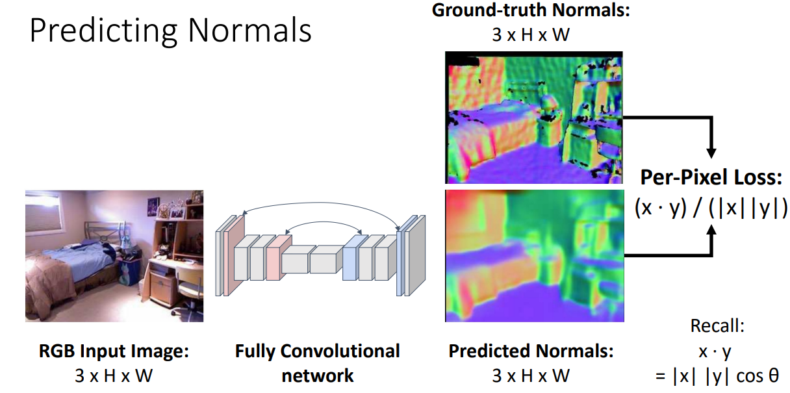
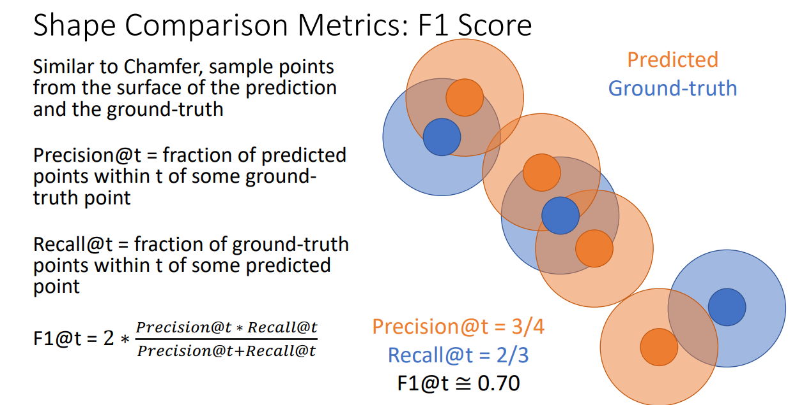

# Reference

**Course code**: EECS 498/598, Winter 2022, L23

**Topic**: 3D Vision

**Lecturer**: Justin Johnson

**Course website**: https://web.eecs.umich.edu/~justincj/teaching/eecs498/WI2022/schedule.html

 

# Course Notes

## Focus on two problems today

 

## 3D Data Types

### Depth Map

 

We could use a scale invariant loss function to bypass the scale/depth ambiguity, and predict depth maps from RGB input images.

 

### Surface Normals

For each pixel, surface normals give a normal vector representing the surface orientation of the object out there in the world.

It's typical to draw surface normals using RGB colors. In the example surface normals below, blue represents pointed up.

 

For the loss function here, we use per-pixel dot product to compare the angles between predictions and ground-truth.

 

Neither depth map nor surface normals can represent occluded parts.

Occlusion occurs when an object hides a part of another object. In the picture below, the photographer (foreground object) occludes a part of the building (background surface).

 

### Voxel Grid

In terms of this data type, the 3D world is represented as some 3D grid. Each cell of the grid has to be turned on or off to say whether the cell is occupied.

Basically, it is like a Minecraft representation of the world.

 

Classifying an object based on its voxel input is fairly conceptually easy.

 

One common network structure of predicting voxels from RGB inputs is bridging the gap between 2D and 3D features with fully-connected layers.

We first process input images with 2D CNN. At the end of 2D CNN, we flatten the 2D features in to vectors and feed them into fully-connected layers. From the output of fully-connected layers, vectors are reshaped back to 3D features. Finally, voxels are predicted by applying 3D spatial upsampling on the features.

The drawback of this approach is that it's very computationally expensive.

 

An alternative is the "Voxel Tubes" shown below. The last layer in the 2D CNN is special, it arranges the spatial convolutions such the 2D spatial size of the final layer of the 2D CNN will be "VxV", and the number of output channels will be "V".

By moving from 3D to 2D CNNs, we gain computation efficiency at the sacrifice of translational invariance in z-axis. One nice property of convolutions is that they don't care about the position in space where inputs are located. For a 3D CNN, any object could occur at any point at 3D space. However, for a 2D convolution, we need to learn a separate filter to represent each possible offset in z-axis.

 

In general, voxel grids take a lot of memory, it is not feasible to use naive voxel grids at high spatial resolutions. 

There are some tricks that scale voxel representations at high resolutions. One of them is oct-tree.

 

### Implicit Function

Learn a function that maps 3D coordinates into {0, 1} representing whether the pixel is occupied or not. 

Compared with a voxel grid that samples such a function at a finite set of points, the implicit function is using the mathematical function itself such that we can sample at arbitrary points.

In the implicit function visualization on the left below, blue means function value 1, red means 0, and 
the white region in the moddle is the level set of 1/2.

 

In reality, we can learn this function by train a network that classifies coordinates as being inside or outside the 3D shape. If we want to extract a explicit shape representation from this learnt function, we can iteratively sample the function at some grids or points of space.

 

### Point Cloud

 

A Point cloud representation represents a 3D shape with a set of points that cover the surface of the shape in 3D space.

A nice property of point cloud representation is more adaptive. We can vary the density of point cloud to represent places with different levels of fine details.

 

PointNet is a structure to process point cloud inputs. Input is a set of "P" points, each of those points has 3 x-y-z coordinates.

The first step is to train a little mlp that receive inputd of 3-dim coordinates and output features of dimentional "D". We can run this mlp independently on each point of cloud.

Then we apply a max-pooling operation over all the points of cloud. This will collapse those "P" points of cloud down to a simple feature of dimentional "D" that is used to compute class score. This max-pooling operation ensures that the order of the points in the cloud does not matter (max computation is invariant with order).

 

Chamfer distance is a typical loss function used in point cloud prediction problems. 

The only way to drive Chamfer distance to zero is if those 2 point clouds coincide perfectly. Also, due to the nearest neighbour operation, the order of points in those 2 sets doesn't matter.

 

### Mesh

Mesh represents 3D shapes as a set of vertices (which is basically a point cloud representation) and triangle faces.

 

Pixel2Mesh is an algorithm that generate a triangle mesh for an object given its RGB image as input.

 

This algorithm has some key ideas:

**Iterative refinement**

 

**Graph convolution**

 

**Vertex-aligned features**

There has to be a way to incorporate RGB information with mesh features, that is, for every vertex in the mesh, we want to incorporate a feature vector representing the visual apperance from the image.

We apply a CNN to generate feature maps, and project all vertex onto image plane using camera information. Then we implement bilinear interpolation, similar to the RoI-Align operation that we have seen, to sample CNN features for all projected vertex.

 

**Loss function**

The loss function should be invariant to the particular way of representing the shape with triangles.

 

## 3D Shape Prediction Metrics

### Voxel IoU

 

### Chamfer Distance

 

### F1 Score

 

### Camera System

 

## 3D Shape Dataset

 

## 3D Shape Prediction: Mesh R-CNN

In Mesh R-CNN, all the detection staff is basically Mask R-CNN, and the 3D prediction part is blend of the methods that we've covered in this lecture.

 

**Hybrid 3D shape representation**

We like the idea of mesh deformation from Pixel2Mesh, but the initial mesh constraints the topology of the 3D shape output (an ellipsoid mesh cannot be converted to a doughnut mesh). This limits the performance of Pixel2Mesh.

To overcome this limitation, we apply methods such as ""Voxel Tubes" to generate a voxel representation to create initial mesh prediction.

 

As the result, we can predict nice mesh with holes.
In comparision, Pixel2Mesh cannot delete triangles at holes.

 

In addition, adding a regularization term further improves the performance.

 

Another nice point about Mesh R-CNN is that it can perform amodel completion.

 

By analyzing failure cases, it can be found that places where 2D recognition fails are also places where 3D recognition tends to fail.

 

# New Topics That Are Not Covered

Neural Radiance Fields (NeRF) for View Synthesis